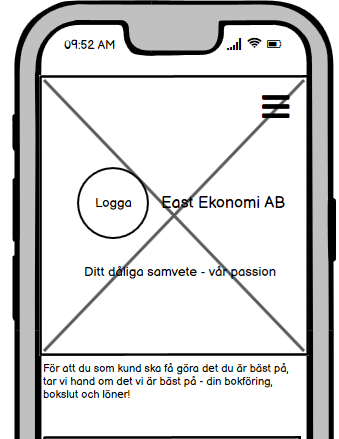
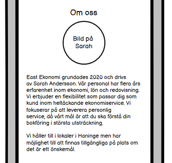

# East-Economy

This site is a company website for East Economy AB. The purpose of the site is to show what services that are offered by the company to potential customers and
others interested in the company. The site is responsive on all devices and it is designed to provide the visitor with an immediate overview of what this company 
offers, while giving an immediate impression of reliability and professionalism. An important focus of the site is also making it easy for the user to get in 
contact with the company for requesting their services or asking questions. Because this is mainly a B2B website, the design is focused on highlighting important
information and facts - since decision making in B2B situations tend to be focused on information-gathering, evaluation of options and rational motivation of decision.

### The business goals of this website is to:

* Attract potential clients
* Show what services this company offers
* Encourage potential clients to make contact with the company
* Provide good UX to give potential clients an impression of professionalism and service-mindedness

### The clients goals of this webite is to:

* Quickly gain information about if this company offers the services that they are looking for
* Get an impression about what value this company offers in terms of engagement in their clients and reliability
* Easily get in touch with the company to further discuss using their services or get additional information about their services

## UX

### The ideal client for this website is:

* Swedish speaking
* A company owner or in a decision-making position in a company

### Visitors to this website are looking for:

* A company providing accounting services or Salary/HR services to help them manage these functions within their own company or the company they are working for
* Gathering information about different companies offering these services so that they can compare offers and make an informed decision about which company to hire

### This website is the best way to help them achieve this because:

* It provides easily accessed information about what services this company offers
* It provides information about this company's values in terms of engagement in their customers
* It provides easily accessible ways of contacting the company

### User stories

1. As a first time visitor, I want to quickly get information about what services this company offers so that I can decide whether it is worth my time to keep exploring the site

2. As a potential client, I want to easily access more information about the services this company offers so that I can gather the information needed for my decision making

3. As a potential client, I want to know what existing clients think of this company so that I can see if the company seems to be appreciated by others

4. As a potential client, I want to know more about the company and their values so that I can decide if they are a good fit for my company

5. As an interested client, I want to be able to easily contact the company so that I can start a conversation about hiring the company

6. As a potential client, an interested client or an observer I want to be able to follow the company on social media so that I can see more of what the company does and get updates

7. As a returning visitor who has deciced to get in touch with the company, I want to be able to navigate immediately to the contact section on the page 

## Features

### Hero section

### Info section

### Testimonials section

### About section

### Contact section

## Credits

### Content

* Images are found here:

Pexels:

Sora Shimazaki

Unsplash:

Volkan Olmez

Sarah Shaffer

NORTHFOLK

Damian Zaleski